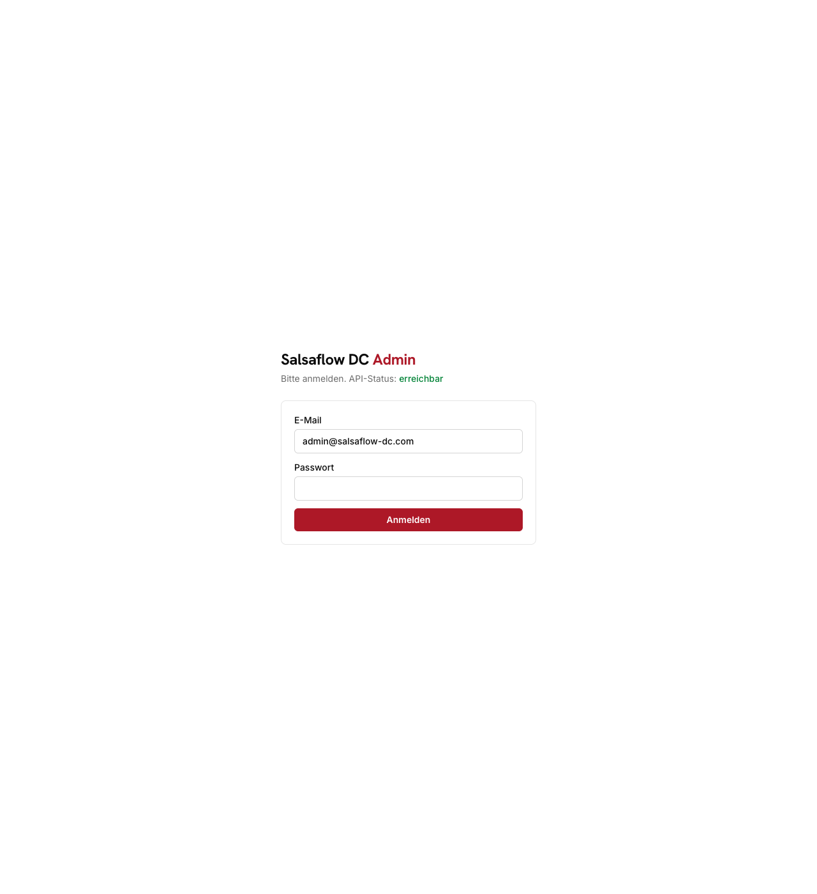
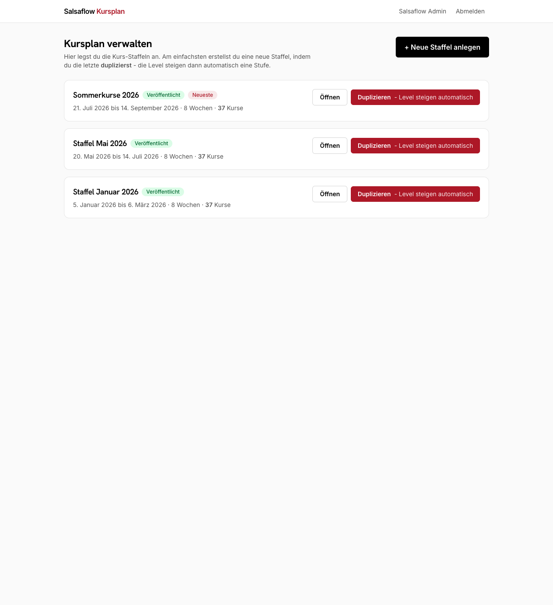
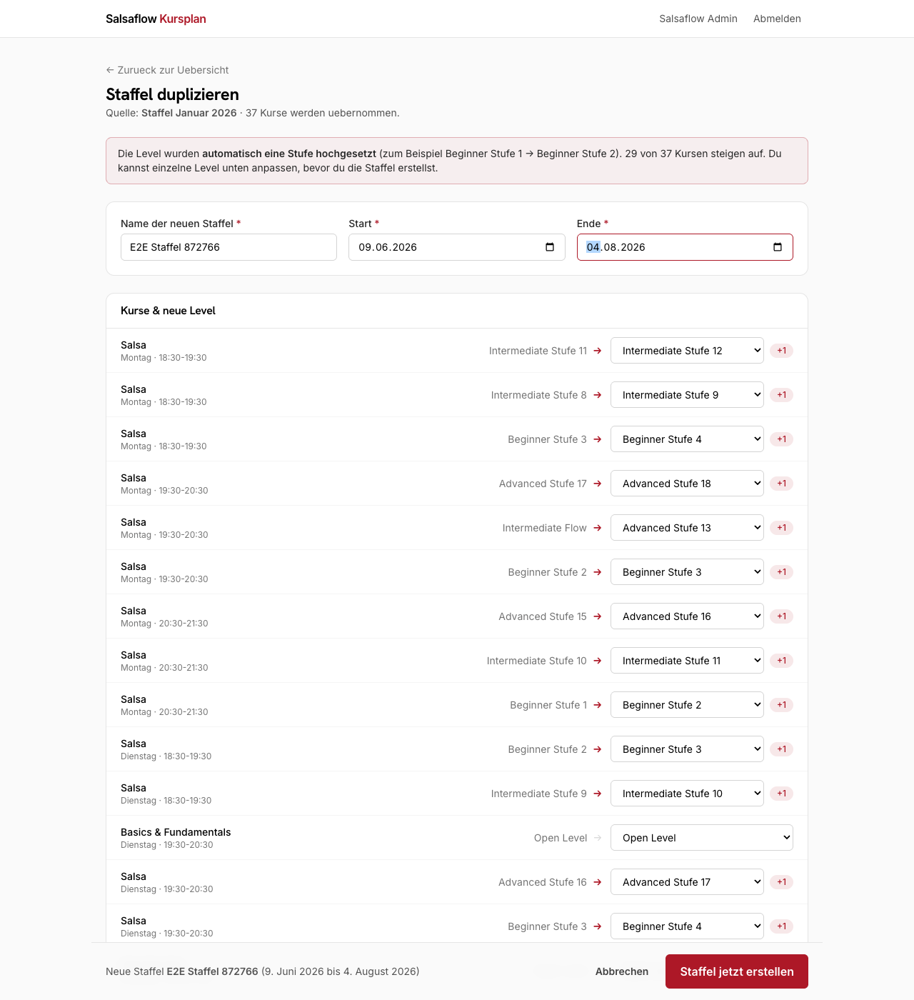
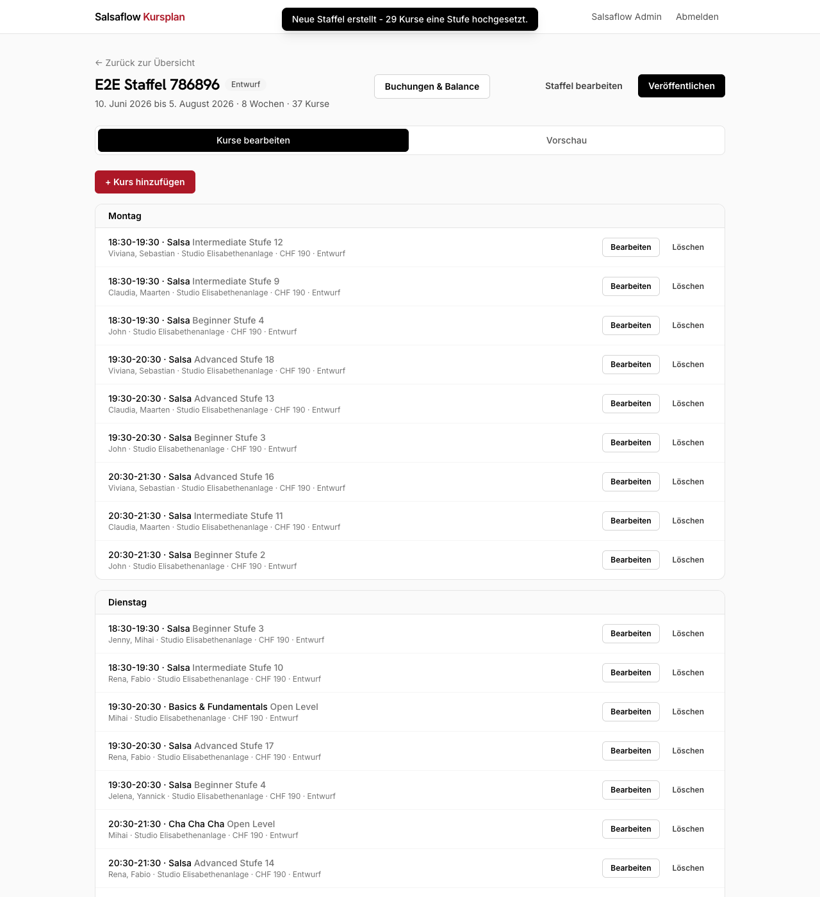
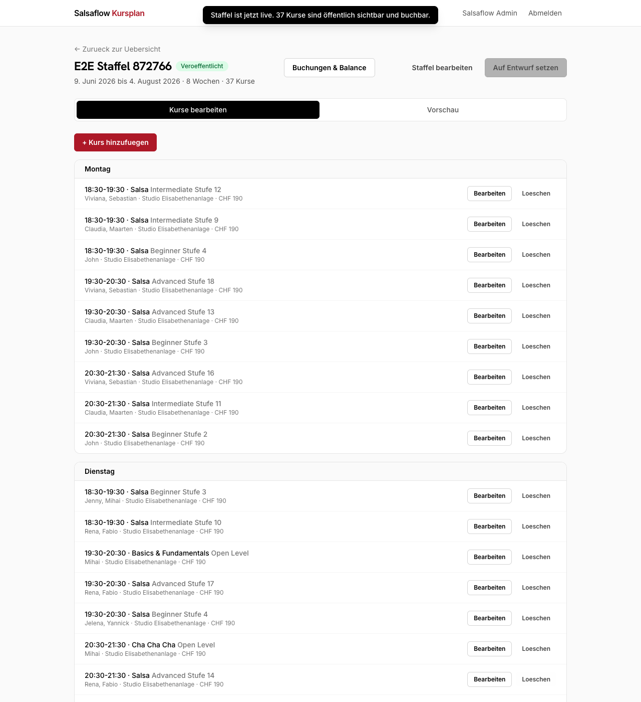
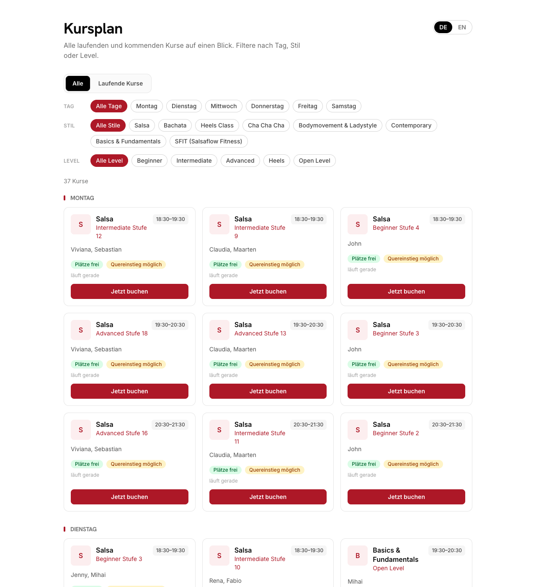
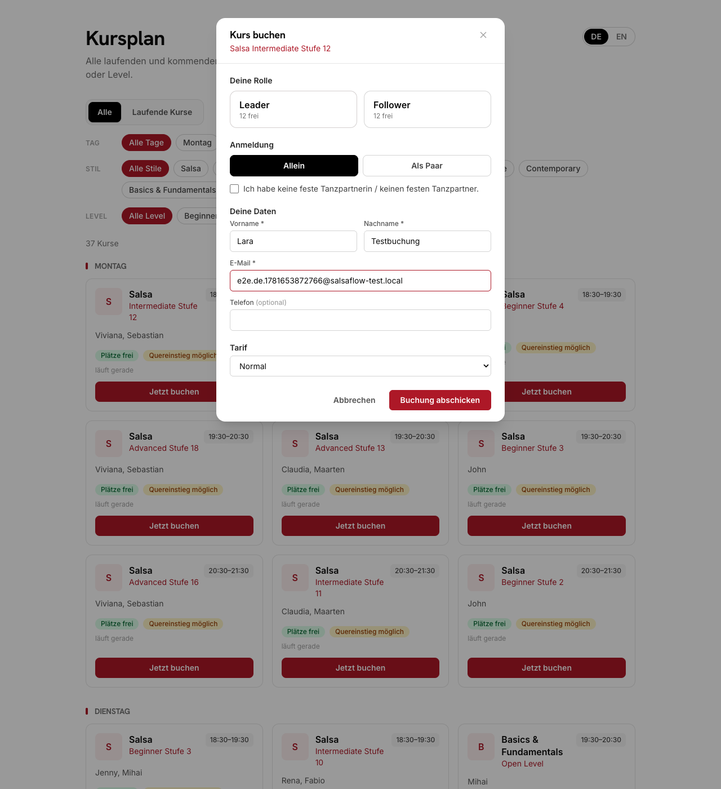
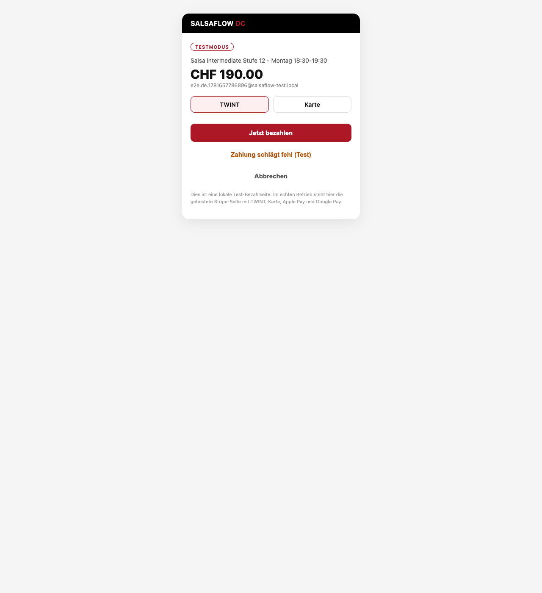
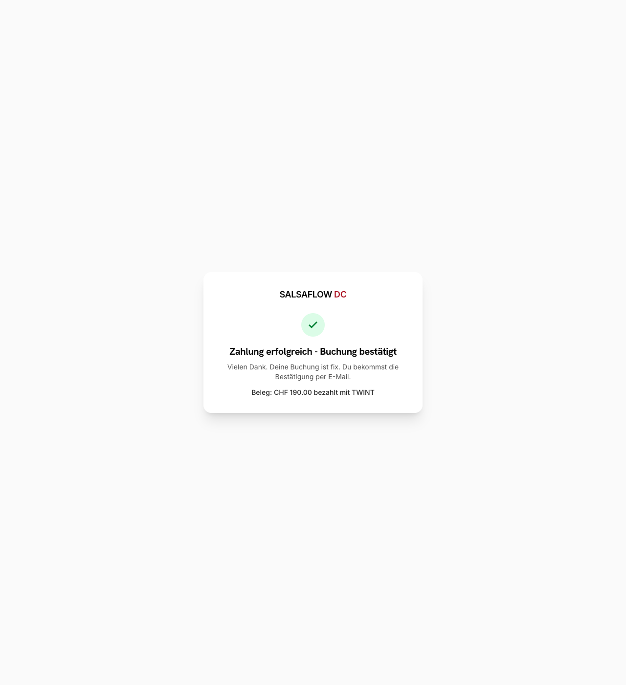
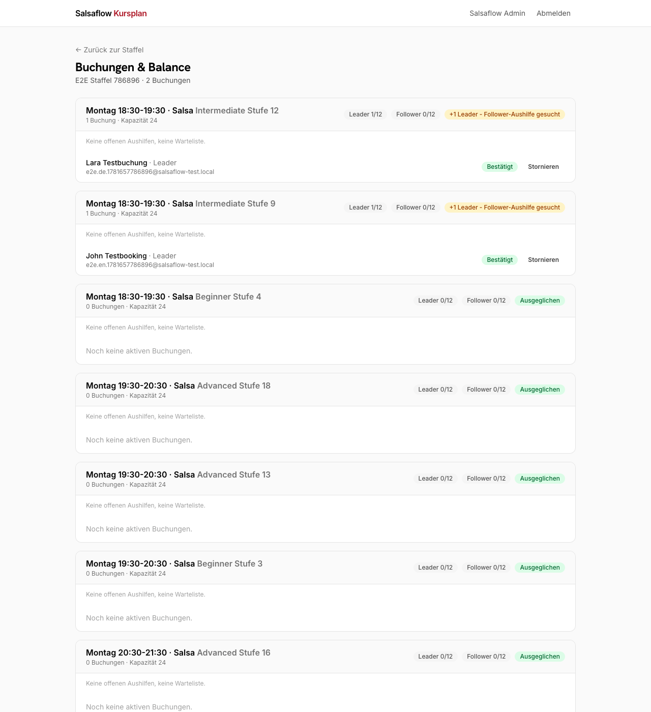

# Dein Kursplan - die Anleitung

**Für Fabio und Claudia.** So pflegst du den Kursplan selbst. Ganz ohne uns.

Früher hast du den Kursplan jedes Mal von Hand gemacht. Auf Deutsch und auf Englisch. Dazu ein Foto für die Webseite. Das ist vorbei.

Jetzt tippst du die Kurse nur noch **einmal** ein. Die Webseite zeigt sie automatisch. Deutsch und Englisch fallen von selbst ab. Und die Gäste buchen und bezahlen direkt online.

> **Wichtig zu den Bildern:** Die Screenshots kommen aus einem Test. Darum heisst die Staffel im Bild "E2E Staffel ...". Bei dir steht da der echte Name, zum Beispiel "Staffel September 2026". Auf den Knöpfen steht oe statt ö und ae statt ä. Das räumen wir vor dem Start noch auf.

---

## Teil 1: Anmelden

Öffne im Browser deine Admin-Adresse. Wir geben sie dir beim Start. Tippe das Passwort ein und klick auf Anmelden.

> Halte das Passwort geheim. Wer es hat, kann den Kursplan ändern.

---

## Teil 2: Neue Staffel anlegen (alle 8 Wochen)

Das ist dein Haupt-Knopf. Du machst keine Staffel von Null. Du **kopierst** die letzte. Die Level steigen dann von selbst eine Stufe hoch. Aus Beginner 1 wird Beginner 2 und so weiter.

**Schritt 1: Übersicht öffnen.** Nach dem Anmelden siehst du alle Staffeln. Die neueste steht oben.

**Schritt 2: Auf Duplizieren klicken.** Klick bei der letzten Staffel auf den roten Knopf **Duplizieren**. Das heisst: kopieren.

**Schritt 3: Vorschau prüfen und Datum setzen.** Oben steht, dass die Level automatisch hochgegangen sind. Rechts bei jedem Kurs steht ein rotes **+1**. Das ist die neue Stufe. Trag oben den **Namen** der neuen Staffel ein. Dann den **Start** und das **Ende** (acht Wochen später). Stimmt ein Level mal nicht, kannst du es bei dem Kurs von Hand umstellen. Danach klick auf **Staffel jetzt erstellen**.

**Schritt 4: Veröffentlichen.** Jetzt bist du im Editor der neuen Staffel. Klick oben rechts auf den Knopf zum **Veröffentlichen**. Fertig. Mit diesem einen Klick sind alle Kurse sofort auf der Webseite und buchbar.

> **Die alte Staffel?** Die verschwindet von selbst, sobald ihr End-Datum vorbei ist. Du musst nichts tun. Willst du sie sofort ausblenden, öffne sie und klick auf "Auf Entwurf setzen".

> **Ein einzelner Kurs ändert sich?** Anderer Lehrer, andere Zeit, fällt aus? Öffne die Staffel, klick beim Kurs auf Bearbeiten und passe ihn an. Oder füge mit dem Knopf zum Kurs-Hinzufügen einen neuen Kurs dazu.

---

## Teil 3: Was der Gast sieht

Das musst du nicht selber machen. Aber gut zu wissen, wie es bei den Gästen aussieht.

**Der Kursplan.** Der Gast sieht alle laufenden und kommenden Kurse. Er kann nach Tag, Stil und Level filtern. Oben rechts schaltet er zwischen **DE** und **EN** um. Du pflegst nur Deutsch. Englisch macht die Webseite von selbst.

**Buchen.** Der Gast klickt bei einem Kurs auf Jetzt buchen. Er wählt seine Rolle (Leader oder Follower) und ob er allein oder als Paar kommt. Dann trägt er seinen Namen ein.

**Bezahlen.** Danach bezahlt der Gast direkt online. Mit TWINT oder Karte. Erst wenn die Zahlung durch ist, ist der Platz fix.

> **Preise:** Im Kursplan stehen keine Preise. Der Preis kommt erst beim Bezahlen. So habt ihr es gewollt.

---

## Teil 4: Wer hat gebucht?

Öffne die Staffel und klick auf **Buchungen & Balance**. Dort siehst du pro Kurs, wer gebucht hat. Und ob Leader und Follower im Gleichgewicht sind.

---

## Spickzettel: neue Staffel in 4 Schritten

1. Anmelden.
2. Bei der letzten Staffel auf **Duplizieren** klicken.
3. Name und Datum setzen, dann **Staffel jetzt erstellen**. Die Level steigen von selbst.
4. Auf **Veröffentlichen** klicken. Jetzt ist alles live.

---

Fragen oder etwas klemmt? Melde dich bei uns, wir helfen sofort.
RH Visuals - Webseite und Pflege für Salsaflow DC.
